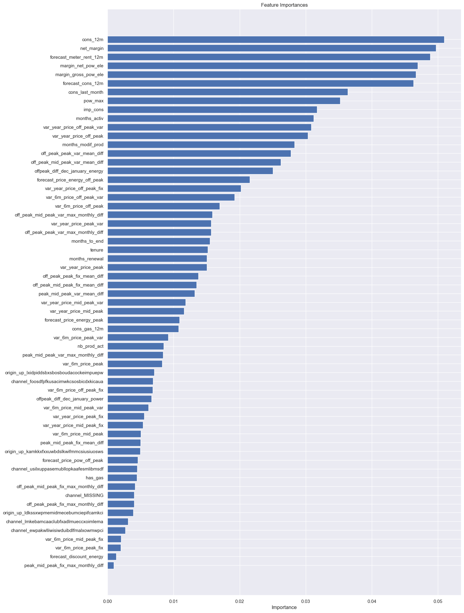

# Customer Churn Prediction — PowerCo Energy Utility

## Project Details
- **Company:** PowerCo (European gas and electricity utility)
- **Business Problem:** Accelerating customer churn in the Small and Medium Enterprise (SME) segment. The initial hypothesis was that churn is primarily driven by price sensitivity.

## Quick Summary
This project provides an end-to-end data science solution to validate the price sensitivity hypothesis, predict at-risk customers, and evaluate a targeted 20% discount retention campaign. The core finding is that price alone is not the dominant churn driver; instead, net margin, consumption volume, and customer tenure are stronger predictors.

## Data Used
- **Client Data:** Customer characteristics, consumption records, and contract metadata.
- **Pricing Data:** Historical pricing data (off-peak, peak, mid-peak) per customer per month.

## Workflow Steps
1. **Business Understanding:** Framing the hypothesis that price sensitivity drives churn.
2. **Exploratory Data Analysis (EDA):** Profiling distributions, detecting outliers, and testing initial correlations.
3. **Feature Engineering:** Creating new features like seasonal price swings, period spreads, and temporal offsets, alongside log transformations.
4. **Predictive Modeling:** Training and evaluating a Random Forest Classifier to predict churn probability.

## Key Results
- **Model Performance:** ~85% accuracy, ~0.82 precision for churn.
- **Top Predictors:** `net_margin`, `cons_12m`, `forecast_cons_12m`, and `num_years_antig`.
- **Targeted Discount ROI:** Applying a 20% discount only to model-flagged customers recovers ~80% of preventable churn at ~3% revenue cost (a 5–7× better ROI than a blanket discount).

*Distribution of churned vs. retained customers.*

*From this chart, we can observe the following points:

- Net margin and consumption over 12 months is a top driver for churn in this model
- Margin on power subscription also is an influential driver
- Time seems to be an influential factor, especially the number of months they have been active, their tenure and the number of months since they updated their contract
- The feature that our colleague recommended is in the top half in terms of how influential it is and some of the features built off the back of this actually outperform it
- Our price sensitivity features are scattered around but are not the main driver for a customer churning

The last observation is important because this relates back to our original hypothesis:

    > Is churn driven by the customers' price sensitivity?

Based on the output of the feature importances, it is not a main driver but it is a weak contributor. However, to arrive at a conclusive result, more experimentation is needed.*

## Recommendations
1. **Deploy targeted discounts:** Apply the 20% discount exclusively to customers with a churn probability ≥ 0.70.
2. **Focus on early-tenure customers:** Implement onboarding and loyalty programs in the first 24 months.
3. **Investigate non-price factors:** Look into service quality and contract complexity as potential churn drivers.
4. **Leverage dual-fuel bundling:** Cross-sell gas contracts to electricity-only SMEs, as dual-fuel customers show lower churn rates.

## Tools & Technologies Used
- Python, Pandas, NumPy
- Scikit-Learn (Random Forest)
- Matplotlib, Seaborn
- Jupyter Notebook
